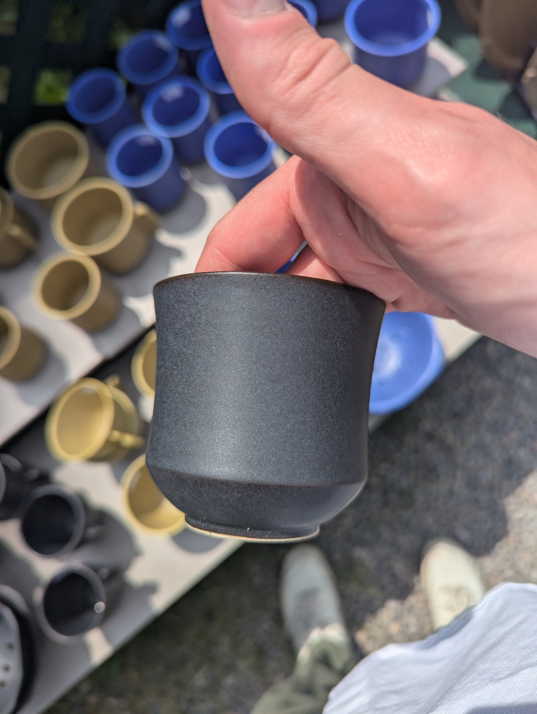

Today we went to 1001 pots in Val David. It's the biggest pottery expo in Quebec and it happens every year. I wasn't super into it in the beginning but I'm glad I went. We went with Lukus and his studio, with Mel and Aaron and her friend in my car.

Some highlights: 

I love this form... I am gonna try to make some stuff like this . I'll probably need a special rib. Update : I have acquired a special rib

This painting is done with something called "china paint" that gets luster-fired on. It would make it not dishwasher safe but it should allow me to explore drawing on my pieces in the cleanest way possible ![[PXL_20250712_190651080.jpg]]

My favourite two potters at the thing:
![[PXL_20250712_191412172.jpg]]

![[PXL_20250712_195029880.jpg]]

I almost bought dishes from each potter and that red jewellry box from the first potter, but then decided against it.

This glaze application is amazing. I gotta start experimenting with layered glazes, they produce such cool results. 
![[Pasted image 20250719073920.jpg]]

I bought 2 teacup looking things from this potter because their glaze was my favourite and I wanted cups for drinking green tea. 
![[Pasted image 20250719074124.jpg]]

Then we went for ice cream and went home. I had my AC fixed specifically for this trip and it was worth it haha, we would have died otherwise. I might have been over 30 C outside, and it was humid.

By going with Lukus I could also ask him a ton of questions, so that was super cool. He told me that he made a bowl with tenmoku glaze and got crystals out of it by just firing it twice, which means I don't have to do a speical firing. He also tuaght me about china paint. 

Luca
